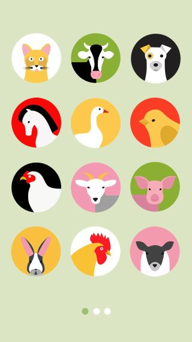

# animal-sounds-app
Animal Sounds App for iOS Xcode Swift

# animalSongS
This is an awesome application of animalSounds , when the user clicks on particular image it makes sounds. UIKit and AVFoundation frameworks are used in this app and with autolayout.
# look at my simple animal soundzz

# Screenshot

# Animal Box
An iOS 10 / Swift 3 based App that when shaken makes the sound of the Animal on the screen. 

### Contributing
See [CONTRIBUTING](CONTRIBUTING.md).

### Licensing
Animal Box is licensed under [the MIT License](LICENSE).

### Support or Contact
Visit [ddApps.co](http://ddapps.co) to see more.
